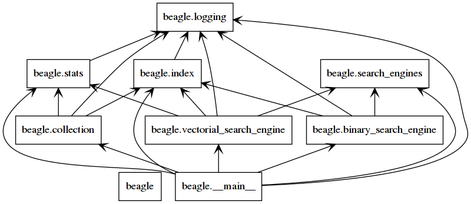
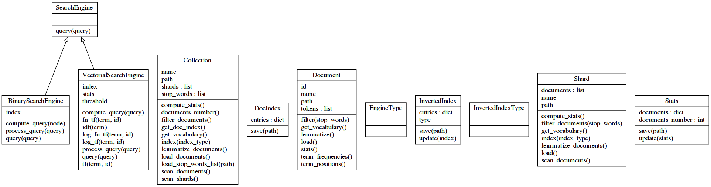
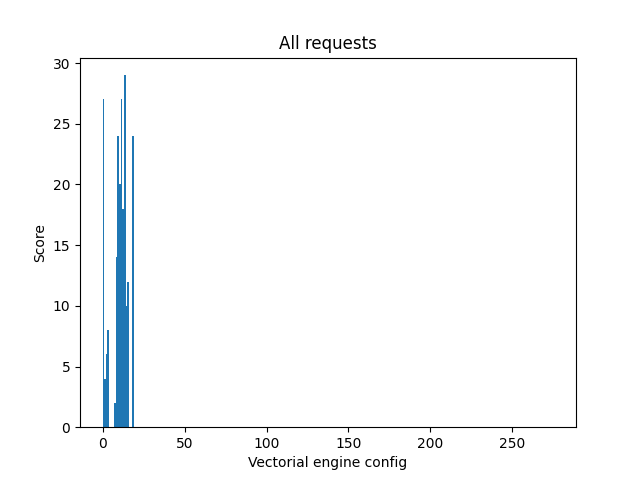

# Project Report

Rémi Calixte & Julien Doutre

## Contents

- [Introduction](#introduction)
- [Beagle's usage](#beagle's-usage)
- [Repository organization](#repository-organization)
- [Tests](#tests)
- [Dataset](#dataset)
- [Indexing engine](#indexing-engine)
- [Search engine](#search-engine)

## Introduction

Beagle is the name of the tool we developped for our **Information Research course**.
The goal was to create a text search engine from scratch based on a specific collection of documents.
It should index the collection in a efficient manner and have at least the capability to answer requests that take the following forms:
- boolean expression (ex: `(cancer OR oncology) AND NOT melanoma`)
- vectorial expression (ex: `cancer oncology`)

## Beagle's usage

### Requirements

Beagle was developped in Python 3.
We make an abusive use of Python type hints to help maintaining a clean and readable code.

It depends ont two Python packages listed in [requirements.txt](../requirements.txt):
- `nltk` is a natural language toolkit that we use for lemmatization
- `ttable` that we use to manipulate boolean expressions

By default, beagle expects to see the collection in a `./dataset` folder.
You can download it from this url: http://web.stanford.edu/class/cs276/pa/pa1-data.zip.
Since the collection is divided in 10 subdirectory, your project tree shoud look like this:
```shell
.
├── beagle/
├── dataset/
│   ├── 0/
│   ├── 1/
│   ├── 2/
│   ├── 3/
│   ├── 4/
│   ├── 5/
│   ├── 6/
│   ├── 7/
│   ├── 8/
│   └── 9/
├── doc/
├── LICENSE
├── README.md
├── report.md
├── requirements.txt
├── setup.py
├── stop_words.json
├── tests/
└── venv/
```

To be able to work, `nltk` needs some dataset to be present on your machine as well.
You can satisfy this requirement with the following:
```shell
(venv) 12:34 julien@julien-XPS-13 ~/dev/beagle% python3
Python 3.6.9 (default, Nov  7 2019, 10:44:02)
[GCC 8.3.0] on linux
Type "help", "copyright", "credits" or "license" for more information.
>>> import nltk
>>> nltk.download("wordnet")
[nltk_data] Downloading package wordnet to /home/julien/nltk_data...
[nltk_data]   Package wordnet is already up-to-date!
True
>>> exit()
```

### Install

In order to avoid polluting your work environment, we recommand to install beagle in a dedicated virtualenv.

You can create a new one with:
```shell
python3 -m venv venv
```

Then enter it with:
```shell
. venv/bin/activate
```

You can install beagle by running the following commmand in the project directory:
```shell
pip3 install -e .
```

### Usage

Beagle takes the form of a cli tool offering two commands:
```shell
usage: beagle [-h] [-v] {index,search} ...

A text search-engine over the Stanford CS276 document collection.

positional arguments:
  {index,search}  available commands
    index         to index the collection
    search        to query the collection

optional arguments:
  -h, --help      show this help message and exit
  -v, --verbose   verbose mode
```

##### Indexing

```shell
usage: beagle index [-h] [-d DATASET] [-t {documents,frequencies,positions}]
                    [-o OUTPUT] [-f]

optional arguments:
  -h, --help            show this help message and exit
  -d DATASET, --dataset DATASET
                        path to the dataset (default: ./dataset)
  -t {documents,frequencies,positions}, --type {documents,frequencies,positions}
                        type of index (default: positions)
  -o OUTPUT, --output OUTPUT
                        path to which save the index and stats (default:
                        ./index/)
  -f, --no-filter       do not filter the tokens with the stop words list
                        (default: False)
```

##### Researching

```shell
usage: beagle search [-h] [-i INPUT] [-e ENGINE] [-o OUTPUT] [query]

positional arguments:
  query                 A query expression. An empty value will start the
                        interactive console. (default: None)

optional arguments:
  -h, --help            show this help message and exit
  -x INDEX, --index INDEX
                        path to the saved index and stats (default: ./index/)
  -e ENGINE, --engine ENGINE
                        the engine to use to perform queries among (binary,
                        vectorial) (default: binary)
  -o OUTPUT, --output OUTPUT
                        to save the results of a direct query to a file
                        (default: None)
```

Unlike the `index` command, `search` will launch an interactive console that allows the user to enter several requests without the need to reload the index (which is a time-expensive operation) if it is not provided a query argument. The console understands some metacommands, prefixed with a `.` (like in the SQLite prompt):
```shell
Welcome! Type .help to get instructions
Current engine: vectorial (documents ponderations: tf, idf ; query ponderations: tf, none)
beagle> .help
The available commands are: [exit, engine, help, set-engine, set-document-ponderation, set-term-ponderation, set-query-ponderation, set-query-term-ponderation, save]
        .exit                   exit the console
        .engine                 display the current engine
        .help                   display this message
        .set-engine <ENGINE>    change of engine (vectorial or binary)
        .set-document-ponderation <PONDERATION> change the vectorial document ponderation scoring (binary, tf, frequency-normalized, log or log-normalized)
        .set-term-ponderation <PONDERATION>     change the vectorial term ponderation scoring (none, idf, or normalized)
        .set-query-ponderation <PONDERATION>    change the vectorial query ponderation scoring (binary, tf, frequency-normalized, log or log-normalized)
        .set-query-term-ponderation <PONDERATION>       change the vectorial query term ponderation scoring (none, idf, or normalized)
        .save <PATH>            save the previous request results to a file
```

## Repository organization

The code of the package itself is contained in [`./beagle`](../beagle).



### Setup

The [`setup.py`](../setup.py) file makes it installable with pip as a CLI tool, with the `main` function defined in [`./beagle/__main__.py`](../beagle/__main__.py) as an entry point.

### CLI

This function contains the CLI logic. Its only purpose is to parse the user input and react by instanciating the appropriate classes and calling their methods.

### Logging

The [`logging.py`](../beagle/logging.py) file defines a specific format for out logging messages as well as the `timer` decorator that allows us to measure and print the execution time of a targeted function. Here is an example with the `InvertedIndex.load_index` method:
- The code:
```python
@timer # the function is decorated
def load_index(path: str) -> InvertedIndex:
    with open(path, "r") as f:
        raw = json.load(f)
        index = InvertedIndex(raw["type"])
        index.entries = raw["entries"]
    return index
```
- The output:
```shell
# Whenever the function is called, its execution time is logged
2020-04-09 11:47:53,634 - root - INFO - Beginning to 'load_index'...
2020-04-09 11:48:12,006 - root - INFO - Finished to 'load_index' in 18.371545s.
```

We use this decorator on critical functions whose we want to evaluate the efficiency and test optimizations on.

### Classes

We use object oriented programming to maintain consistency between the data structures we manipulate and their behaviors.



#### [`collection.py`](../beagle/collection.py)

Classes related to the import, reading and processing of collection's file.

`Document` enables to load the content of a single file to retrieve its tokens. It keeps track of its path so it can be given as an output to the user later on, and assigns it an integer id for internal use. Then it defines several methods to operate on the tokens, such as:
- filtering them with a stop words list
- lemmatize them

and get metadata about them:
- the document vocabulary (set of distincts tokens)
- term frequencies (counter of occurences for each term)
- term positions (dictionnary storing for each term its frequency and a list of its positions in the document)
- stats (dictionnary storing: the maximum frequency among the terms frequencies, their sum, the number of unique terms in the document)

Note that these frequencies are number of occurences. Indeed we did not want to store float typed values in JSON since we would have lost accuracy. The number of tokens in the document is saved as well so that the real frequencies can be computed later.

Since the collection is divided in subdirectories, we introduced an intermediate level of abstraction called a `Shard`, corresponding to all the files in a subdirectory. `Shard` enables to list all the files in its path, and store them as a list of `Document` objects. It can then load, filter and lemmatize all of them, get their overall vocabulary, compute stats about them (see class `Stats`) and finally build a reverse index on them (see class `InvertedIndex`).

The reason we introduced the `Shard` class is that we wanted to test our first implementations on only a part of the dataset.

Finally, `Collection` is the overall object that operates on a list of shards. It can indeed list the subdirectories in its path to construct a list of `Shard`, load them and perform the same computation they can, but on all the shards, so on all the documents. It can also load a stop words list from a JSON file, and finally build a `DocIndex` that maps documents id to their path (see `DocIndex`).

#### [`stats.py`](../beagle/stats.py)

Classes enabling to compute, save and load collection's statistics.

`Stats` stores in a dictionnary, the number of documents in the collection, andl their statistics:
- the document vocabulary (set of distincts tokens)
- term frequencies (counter of occurences for each term)
- term positions (dictionnary storing for each term its frequency and a list of its positions in the document)
It has a method to be saved as a `json` file.
Its `update` method allows to merge two `Stats` objects. It is used by the `Collection` object when it needs to compute `Stats` for the whole collection, it get the `Stats` of every `Shard` and merge them.


The module also contains a function that creates a `Stats` object from a JSON file.

#### [`index.py`](../beagle/index.py)

Classes related to the creation of inverted indexes.

`InvertedIndeType` is an enumeration of our supported index types. There are three different types:
- `documents`: a simple list of documents ids that contains a term
- `frequencies`: a list of documents ids that contains a term and the term occurences in each one
- `positions`: a list of documents ids that contains a term and the term occurences in each one plus their positions

`InvertedIndex` stores an inverted index as a dictionnary that associates one of the previously described items to each term found in the collection. As the `Stats` class, it can also be saved in a JSON file, and has an update method, used by the `Collection` object to merge the inverted index of all the shards in one.

`DocIndex` stores a mapping between a file path and its id in a dictionnary. It can be saved as a JSON file.

The module also contains functions that create `InvertedIndex` and `DocIndex`objects from JSON files.

#### [`search_engines.py`](../beagle/search_engines.py)

Interfaces and custom types for search engines.

`SearchEngine` is an interface defined by one method `query` that returns for a query string a dictionnary of documents ids and a score.

`DocumentPonderation` and `TermPonderation` enumerations refer to the possible ways of computing the weights of a document or a query in a vectorial approach.

`EngineType` is an enumeration of our supported engines: binary or vectorial.

#### [`binary_search_engine.py`](../beagle/binary_search_engine.py)

Logic to perform boolean research.

`BinarySearchEngine` implements the `SearchEngine` interface. It contains internal methods to preprocess a query, construct a boolean expression tree from it, walk it and return the matching results. Its constructor must receive an `InvertedIndex`.

#### [`vectorial_search_engine.py`](../beagle/vectorial_search_engine.py)

Logic to perform binary research.

`VectorialSearchEngine` implements the `SearchEngine` interface. It contains internal methods to compute tf-idf values for the query and documents in the collection, returning the matching results. Its constructor must receive an `InvertedIndex` and `Stats` about the collection.

## Tests

We use `pytest` for our unit tests.

They are defined in the [tests/](../tests/) directory.

You can run all the tests with
```shell
pytest
```

Some tests are skipped by default. Indeed, they are the ones we used to perform benchmarks of our engines configuration.
They are very long to run (an hour) since they test every possible configuration of the vectorial engine (there are 225 possible ponderation combinations).
Their results have been saved and pushed in the [`./tests/queries/`](./tests/queries/) folder.
They require to have built and saved at least a frequency index at `./index/`.

## Dataset

The dataset is the Stanford CS276 documents collection (http://web.stanford.edu/class/cs276/pa/pa1-data.zip).

It contains 98 998 documents with about 10 000 documents in each one of its 10 subdirectories (that we call shards in this project):
```shell
shard 5: 9997 documents
shard 2: 10000 documents
shard 3: 10000 documents
shard 8: 10000 documents
shard 4: 9999 documents
shard 6: 9998 documents
shard 0: 10000 documents
shard 9: 9004 documents
shard 7: 10000 documents
shard 1: 10000 documents
```

## Indexing engine

The indexing perfoms the following steps:

### Files loading

- instantiate a `Collection` object with the path to the dataset. It is for now an empty object.
- scan the collection shards. It lists the subdirectories paths in the dataset folder, and creates empty `Shards` objects saved in the `Collection`'s list. This step takes about 0.00006s on our machines.
- scan the documents in each shard. It lists the documents paths in each shard and create empty `Document` objects saved in each `Shard` list. This step takes about 0.4s on our machines.
- load all the documents. It calls every `Document`'s `load` method to save their tokens in memory. This step takes about 30s on our machines.

An integer id is attributed to each `Document` at instanciation. Since there are maximum 10 000 documents in a shard, the id is built as follow: `shard_id * 10**4 + document_index_in_the_shard`. Note that this convention would not work if the collection was dynamic (*id* that new documents could be added to shards).

In total, this step takes about 30s which is due to the documents loading.
We don't really see any possible optimization for this, since we need at some point to get the content of every document to create our index.

### Stop words

- compute or load a stop words list
- filter every document with it

At first, we thought to build this list from the collection by taking its 200 most frequent words. This gave us the following list:
```shell
['the', 'of', 'and', 'to', 'stanford', 'in', 'a', 'for', 'on', 'is', '&', 'university', 'by', 'at', 'this', \
'1', 'with', 'research', 'from', 'are', 'home', 'all', 'center', 'or', 'us', 'page', 'you', 'contact', 'be', \
'about', 'that', 'search', 'as', '2', 'news', 'students', 'school', 'program', 'edu', 'your', 'information', \
'resources', 'not', 'an', 'new', 'faculty', '3', 'events', 'will', 'can', 'it', 'slac', 'use', '2012', \
'education', 'i', 'site', '650', 'department', '2011', 'more', 'have', 'we', 'if', 'programs', 'library', \
'may', 'posting', 'student', '4', 'other', 'medicine', 'science', 'e', 'data', 'has', 'one', 'alumni', \
'our', 'which', 'people', 'email', 'next', 'staff', 'law', 'overview', 'engineering', 'how', 'terms', \
'international', '5', 'forum', 'publications', 'copyright', 's', 'number', 'thread', 'no', 'only', '10',\
'find', 'services', 'health', '94305', 'content', 'help', 'community', 'links', 'studies', 'policy',\
'graduate', 'text', '12', 'public', 'was', '2010', 'up', 'web', 'login', 'office', 'ca', 'energy', 'author',\
'time', 'list', 'project', 'current', 'also', 'development', '11', 'work', 'he', 'their', 'support',\
'history', '723', 'pdf', 'get', 'group', 'what', '2009', 'postings', '6', 'see', 'its', 'message',\
'depth', 'map', 'pm', 'they', 'institute', 'sciences', '30', '0', 'd', 'view', 'related', 'system',\
'medical', 'calendar', 'click', 'service', 'add', 'directions', '8', 'california', 'first', 'display',\
'do', 'professor', 'navigation', 'courses', 't', 'please', 'skip', 'lab', '00', 'http', '7', 'campus',\
'main', 'systems', 'there', 'technology', 'x', 'projects', 'any', 'class', 'social', 'title', 'request',\
'2008', 'forums', 'previous', 'rights', 'here', 'who', 'last', 'course', 'these']
```

There are indeed words that does not bear any meaning such as `the`, `of`, `to`, etc. But we also do have a lot of words that are interesting and that we want to keep in the documents such as `engineering`, `california`, etc. Their presence in such a big frequency is due to the nature of the collections: it is a university dataset that contains a lot of scientific articles.
We can see also that file extensions (`pdf`) and protocols nams (`http`) are present. This dataset comes from web pages, so the presence of hyperlinks can explain this result.

This is not a satisfying stop words list since it will remove meaningful information from documents. Instead, we chose to remove english null words following a stop words list established by https://gist.github.com/sebleier/554280. It removes a great deal of words that does not bring context (including their derivated forms). It is only 200 words long.

We tried both lists on our collection:
- initial number of tokens: 25498340
- after removing the top 200 words list: 14423577 so a reduction of 43% in tokens number
- after removing the stop words list: 18968691 so a reduction of 26% in tokens number

Our stop words list removes less tokens as expected since it does not contains all the words from the top 200 but we assumed that a 25% reduction was a good improvement anyway.

The filtering takes about 60s on our machines (loading the list from a JSON file takes only 0.0001s so is negligible compared to that).

### Lemmatization

- lemmatize all the documents

We use the `nltk` and its `wordnet` dataset to perform this task.

We tested both lemmatization and stemming:
- initial vocabulary size: 346904
- after lemmatization: 335866 so a reduction of 3% in vocabulary size
- after stemming: 305783 so a reduction of 12% in vocabulary size

The lemmatization takes about 60s on our machines and the stemming 300s.
This is an unexpected results since the stemming seems less complex to compute than the lemmatization. We do not have an explanation for it yet.

We decided to continue with lemmatization. Indeed, this process seems less brutal to us in the sense that it has less probability to trim a word the wrong way. Since lemmatization is far quicker and has the same magnitude of vocabulary reduction, we think this is a reasonable choice.

### Build the index

- create the collection inverted index
- save it as a JSON file so it can be imported when running the `search` command

Once again we first create an inverted index for each `Shard` that we merge in one final index.
Here are the step's performances for our different index types on our machines:
- documents
  - indexing time: 20s
  - saving time: 5s
  - JSON size: 100 MiB
- frequencies
  - indexing time: 20s
  - saving time: 30s
  - JSON size: 150 MiB
- positions
  - indexing time: 60s
  - saving time: 60s
  - JSON size: 257.4 MiB

We did not implement any compression method since the output is not that heavy.
Moreover it would have make the saving and loading of the index longer whereas our focus is on the time execution of our commands.
Finally I am not sure of the way Python is handling its `int` type internally, and so the impact it could have on the gamma code optimization.

However, we witnessed an interesting behavior of Python. At first, our index structure was much more complex and involved several classes that were handling the different data of each part: an `InvertedIndex` stored a list of `InvertedIndexEntry` objects, each one having a `term`, `documents_number` attributes and then a list of objects implementing an `InvertedIndexData` interface (these objects were different following the index type). The idea was to have a modular code that would allow us to hide the index types differences behind an interface and so make the indexing algorithm cleaner.
This approache's performances were disastrous. It was from 10 times to 100 times longer than the indexing times we previously gave, depending on the index type.
We understood quickly that it was linked to the Python way of handling objects. It is not at all overhead-free as in other languages like Go or Rust that provide zero-cost abstractions. We rolled back to an unstructured index contents.

### Stats

The vectorial search engines requires some statistics about the collection. They are computed at this step.

This is independent of the index type and takes about 5s on our machines, plus less than a second to save them in a JSON file.

### Ids / path mapping

The `SearchEngine` interface requires the `query` method to return a list of ids of documents. In order to present a readable output to the user, we save a mapping of those ids and the file corresponding paths stored in a `DocIndex` object.

This steps takes less than a second on our machines to be performed and save the mapping in a JSON file.

### Conclusion

We can identify time consuming steps:
- load the documents
- filter and lemmatize them
- create the index
- save the index

Among these steps, the only one that we could improve with further optimizations (from an execution time perspective) seems to be the index creation.

We noticed that after the end of the last operation, Python took some time (1s to 3s) that must be linked to the garbage collection of the used memory.

We added a flag to the command line to avoid the filtering step and see its impact on the index metrics.
Its size grows to 300 MiB for a position index (the maximum possible growth). The filtering steps is not performed so we win 60s of computation. The index creation becomes a bit longer (about 15s more). However, the time to save it triples. In the end, this does not lead to a lesser execution time but its size does not increase a lot.

## Search engine

The `search` commands performs the following steps:

### Load the index

Since the index type is saved in the JSON, there is no need to pass it as an argument to the search engine. It will automatically create an `InvertedIndex` objects corresponding to the correct contents layout.

Here are the performances for our different index types on our machines:
- documents: 2s
- frequencies: 7s
- positions: 10s

Since there is no need to decompress the data we can hardly improve these loading time.

Then the stats JSON is loaded, which takes approximately 0.1s on our machines. Currently, we load it anyway but we could load it lazily when its usage is truly needed, *ie* when the user wants to perform a query using the vectorial engine.

Finally the ID mapping is loaded which takes approximately 0.1s on our machines.

Then the `SearchEngine` instantiation is almost instantaneous.

### Binary research

This engine uses the `ttable` package to build a boolean expression tree with `tt.BooleanExpression(" ".join(tokens__list)).tree`.
Then we do a recursive DFS on this tree, walking over its `tt.ExpressionTreeNode`.
Each time the algorithm encounters a boolean connector (`AND`, `OR`, `NAND`) it performs a recursive call over the child nodes inside an intersect, merge or exclude function respectively. These functions returns a list of document ids from two lists of document ids. When the algorithm encounters a leaf (which is a lemmatized term), it returns the list of document ids containing this term by reading the associated inverted index entry.

### Vectorial research

#### Principle

This engine finds the documents whose vector's representation in the terms vectorial space has the highest dot product with the query vector's representation in the same vectorial space.

We loop over the tokens of the query and get their associate lemmatized terms. We fetch the documents ids list that contains this term from the inverted index. For each of these document, we compute a score for the current term (using score functions depending on the Engine configuration) and add it to the dot product for this document (stored in a dictionnary). Then we return the reverse sorted list.

#### Benchmarks

We had access to a list of queries and their expected outputs.

**Disclaimer: We assumed that the expected outputs were sorted by relevance but it is not the case. They are simply sorted by shard and by name, which ruined our comparison score. We let out results in this subsection to explain the methodoly we applied but they should not be considered for any deduction about our engine performances. The only thing we can say is that our results lists contain all the expected documents. This is logical: all the documents that contains the term are in the inverted index entry so are returned, only their relevance score can differentiate them.**

We performed benchmarks to assess the accuracy of our results against some tests queries (you can find them in [tests/queries/query.*](../tests/queries/)).
The sorted expected results are in [tests/queries/query.*.out](../tests/queries/)) files and the benchmarks scores in [tests/queries/query.*.benchmark](../tests/queries/)).

The possible configurations are simply the cartesian product of the document and terms ponderation for the documents and the query. There are 225 of them.

We evaluated the results score by summing for each document in the expected result list `1 / (1 + abs(index(output) - index(expected)))`, *ie* the inverse of the difference of indexes in the ordered results list from our output and the expected ones.

We did not tested the requests 5 to 7 because they query the index over stop words.
With the filtering the results list returned by our engine is empty. Without filtering, we return almost all the documents of the collection since these words are really common.

The results for each test query have been saved separatly in [`tests/queries/`](../tests/queries/).
Here follow the histogram of the total scores for each configuration:



We isolated the by-score-sorted configurations in [`tests/queries/top.txt`](../tests/queries/top.txt).
